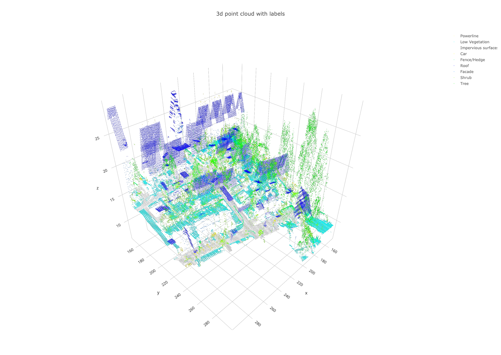
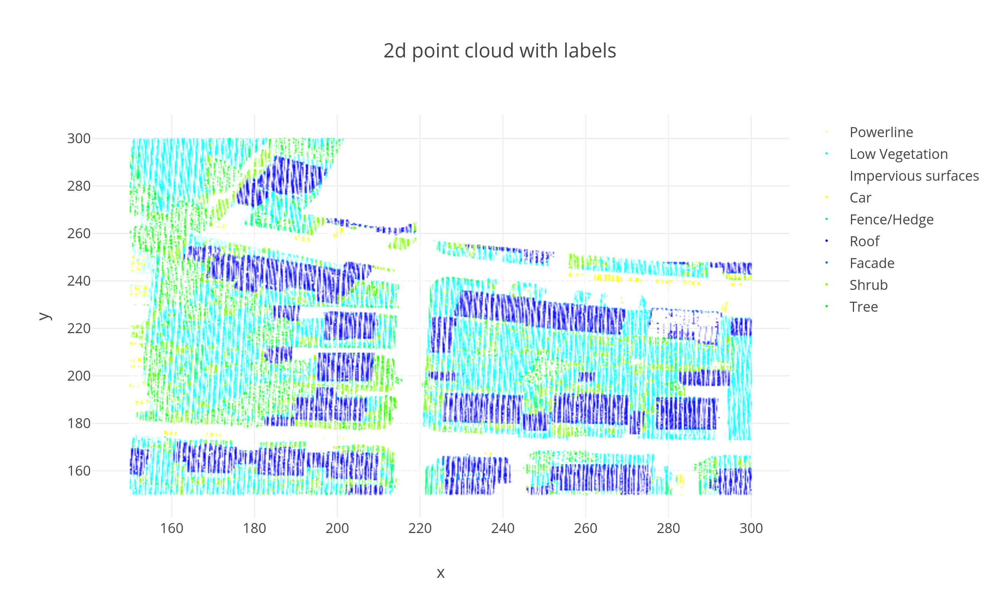

# Spectral Graph Filter Learning for Point Labeling in Airborne LiDAR Data
Yinan ZHANG, Eda BAYRAM

## Background
Airborne Laser Scanning data provides quite dense and highly accurate, yet unorganized point cloud descriptions of the earth surface. For this 3D semantic labelling challenge, we focus on the extraction of building objects. Weighted graphs (highlighting different features) are used to represent these irregular 3D data types.  In this project, We will do a spectral analysis of signals residing on the graph based on typic spectral attributes of the buildings.

The training set contains 753876 cloud points in total. For each point, information about xyz coordinates, intensity, return_number, number of returns and label is given, but we only care about xyz coordinates and the label. Data ponits are randomly distributed in each category as shown below.

label index|label name|number of points
-----------|----------|------
0|Powerline|546|
1|Low Vegetation|180850
2|Impervious surfaces|193723
3|Car|4614
4|Fence/Hedge|12070
5|Roof|152045
6|Facade|27250
7|Shrub|47605
8|Tree|135173

Howerver the training set exists duplicated points, with the propotion of 5.43% of the dataset. After deleteing those points, there remains 157488 points.

We extract a small patch of the training scene and visualize it on the 3D domain and 2D domain as shown below. The color coding in the image showing the training area is：

R|G|B|label
-|-|-|-----
255|255|125|Powerline
0|255|255|Low vegetation
255|255|255|Impervious surfaces
255|255|0|Car
0|255|125|Fence/Hedge
0|0|255|Roof
0|125|255|Facade
125|255|0|Shrub
0|255|0|Tree

## Structure
Notebook 1: data visualization
Notebook 2-4: graph construction
Notebook 5: construct different graph types on different patches and compare filter reponses
Notebook 6: how to overcome unequal point density distribution
Notebook 8-9 filter learning

## Running
Before you download and execute code, please go to the following link to download the data and put it the directory named 'data':
https://drive.google.com/file/d/1ygN12cDL0uMuZLxZ1pQqrrBF6Xn7rkwA/view?usp=sharing

## License & Citation
The code is under the MIT License. Please cite our code if you use it.
@misc{FilterLearning,
  author = {Yinan Zhang, Eda Bayram},
  title = {Spectral Graph Filter Learning for Point Labeling in Airborne LiDAR Data},
  year = {2019},
  publisher = {GitHub},
  journal = {GitHub repository},
  howpublished = {\url{https://yinanzhangepfl.github.io/Filter-Learning-LiDAR/}},
}
